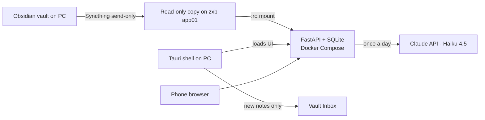

# zxb-pet · Zebot

[](https://github.com/zebas404/zxb-pet/actions/workflows/ci.yml)

A Tamagotchi-style desktop pet that greets you at login with your pending tasks and what to study today. It reads an Obsidian vault (read-only) and writes a daily message with Claude, in the voice of **Zebot**: a sarcastic, gamer-slang sidekick whose energy, happiness and streak depend on your real progress.

> 🚧 Work in progress: Phase 1 (local backend) done.

## Architecture



| Layer | Choice | Why |
|---|---|---|
| Sync | Syncthing, one-way | The server can never modify the vault |
| Backend | Python 3.12, FastAPI, SQLite | Small footprint on a 3 GB homelab VM |
| LLM | `claude-haiku-4-5`, cached per day | Cents per month |
| Runtime | Docker Compose, read-only rootfs, non-root user, memory and CPU limits | Least privilege |
| Client | Thin Tauri shell + web UI served by the backend | UI changes deploy server-side only |

## API

| Endpoint | Description |
|---|---|
| `GET /health` | Liveness, vault mount and config check |
| `GET /tasks` | Open tasks parsed from the vault (`?include_done=true`, `?limit=N`) |
| `GET /study` | Current and next phase of each study roadmap |
| `GET /pet` | Pet state: mood, energy, happiness, streak, level, adaptive difficulty |
| `GET /briefing` | Zebot's daily message (`?refresh=true` regenerates it; limited per day) |
| `GET /docs` | Interactive OpenAPI docs |

### How the vault is parsed
- **Tasks:** Markdown checkboxes (`- [ ]`, `- [x]`) in `01-Proyectos/` and `02-Areas/` notes with `estado: vigente`, including nested items and callouts. Code blocks are ignored. Tasks under *Próximos pasos* come first, then tasks in the current dated phase. Open tasks in a phase that already ended are flagged `overdue`, and duplicates across notes are merged.
- **Study:** `Roadmap - …` notes with headings like `### Fase 1 — Title (2026-10-05 → 2026-10-18)` or `(octubre 2026)`. The phase containing today is the current one.
- **Progress:** checkboxes carry no completion date, so each sync snapshots them in SQLite. A task that flips from `[ ]` to `[x]` counts as activity for that day.

### Pet rules
- **Streak:** consecutive days with activity.
- **Energy:** drops for each idle day (10, 15 or 25 points depending on difficulty).
- **Happiness:** based on the number of active days in the last week and the study pace (actual vs. expected progress in the current phase).
- **Adaptive difficulty:** one level harder after 3 idle days, one level easier after a 7-day streak.

## Run locally

Requires Python 3.11+.

```powershell
cd backend
python -m venv .venv
.venv\Scripts\Activate.ps1
pip install -r requirements-dev.txt
pytest                       # unit and API tests; the Claude API is mocked

$env:VAULT_PATH = "C:\path\to\SegundoCerebro"
$env:DATA_DIR   = "$env:TEMP\zebot-data"
uvicorn app.main:app --port 8000
```

Then open http://127.0.0.1:8000/docs. Without `ANTHROPIC_API_KEY`, `/briefing` falls back to a template message, and that fallback is never cached.

## Run with Docker Compose

```bash
cp .env.example .env         # set VAULT_HOST_PATH and ANTHROPIC_API_KEY
docker compose up -d --build
curl -4 http://localhost:8000/health
```

## Security notes
- The vault is mounted read-only; the backend never writes to it.
- Secrets live only in `.env`, which is git-ignored.
- The container runs as a non-root user with a read-only root filesystem and `no-new-privileges`.
- `?refresh=true` is capped per day to bound API spend.

## Roadmap

- [x] F0 · Exploration and parser rules
- [x] F1 · Local backend + tests
- [ ] F2 · Deployment (Syncthing + Docker Compose on Proxmox VM)
- [ ] F3 · Web UI (original pixel-art sprite)
- [ ] F4 · Tauri shell (transparent, always-on-top, autostart)
- [ ] F5 · "I did X" capture to Inbox + pet state tuning
- [ ] F6 · Extras (Anki, Job Hunter stats, macOS shell)
