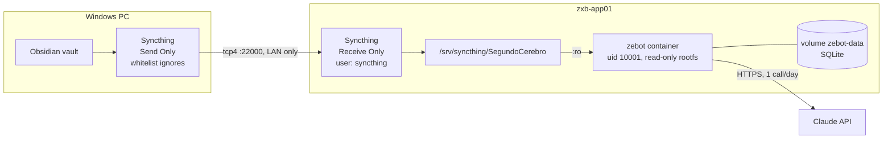

# Deployment (homelab)

Target: `zxb-app01` (Proxmox VM, Debian 12, Docker, 192.168.1.63). The vault reaches the server through one-way Syncthing, and the API runs with Docker Compose.



## Design choices

| Choice | Why |
|---|---|
| Syncthing **Send Only → Receive Only** | Nothing on the server can ever write back to the vault. Local changes on the server are flagged and revertible. |
| **Whitelist** ignore patterns ([`deploy/syncthing/stignore.txt`](../deploy/syncthing/stignore.txt)) | Data minimization: only the folders the parser reads leave the PC. CVs, PDFs and app config stay home. |
| Dedicated `syncthing` system user, GUI bound to `127.0.0.1` | Least privilege. The admin GUI is reached through an SSH tunnel and is never exposed on the LAN. |
| Global discovery, relays and NAT traversal disabled; listen on `tcp4://0.0.0.0:22000` | Traffic stays on the LAN, IPv4 only (the network has no IPv6). |
| `.env` copied with `scp`, `chmod 600` | The API key never goes to git, the vault or chat logs. |
| Container: non-root, `read_only`, `no-new-privileges`, 256 MB / 0.5 CPU | Hardened by default on a shared 3 GB VM. |

## Steps (summary)

1. **Server:** install Syncthing from `apt.syncthing.net` (`stable-v2`), create the `syncthing` system user, `systemctl enable --now syncthing@syncthing`.
2. **PC:** install the official `syncthing.exe` (verify the SHA-256 against the release's `sha256sum.txt.asc`) and autostart it at logon with Task Scheduler (`--no-browser --no-console`).
3. **Pairing:** device address `tcp4://192.168.1.63:22000`. Folder *Send Only* on the PC, with the whitelist pasted **before** sharing. Accept it on the server as *Receive Only* in `/srv/syncthing/SegundoCerebro`.
4. **App:** `git clone` into `/opt/zxb-pet`, `scp` the `.env`, then `docker compose up -d --build`.
5. **Verify from the PC:** `scripts/smoke-test.ps1` (health, tasks, study, pet, briefing).

## Updates with least-privilege sudo

```powershell
ssh zxb-app01 sudo zebot-deploy
```

[`deploy/zebot-deploy.sh`](../deploy/zebot-deploy.sh) is installed root-owned as `/usr/local/bin/zebot-deploy`. A sudoers rule allows exactly that command, with **no arguments**, without a password; every other `sudo` still asks for one. The script runs `git pull` as the repo owner, then `docker compose up -d --build` and prunes dangling images. Changing the script in the repo does not change what runs as root until it is explicitly reinstalled.

Trade-off: Docker access is root-equivalent, so whoever controls `main` controls what gets built. That is acceptable for a single-owner repo where every change is a reviewed commit.

Pet state lives in the `zebot-data` volume and survives updates.

The full step-by-step runbook (in Spanish, with rollback and troubleshooting) lives in the author's Obsidian vault.
